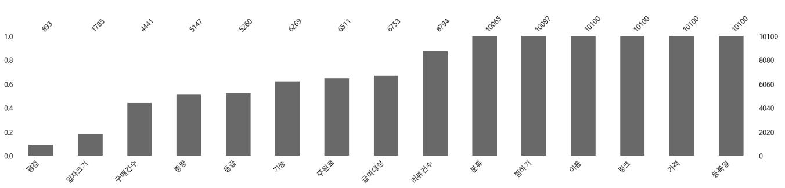
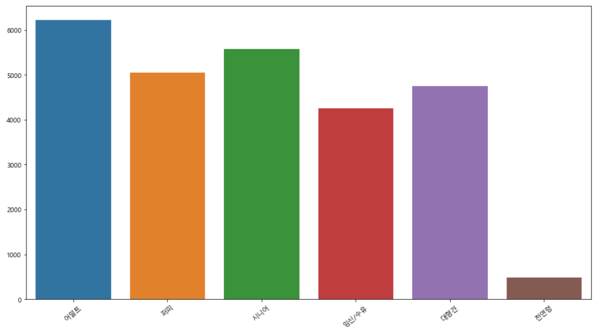
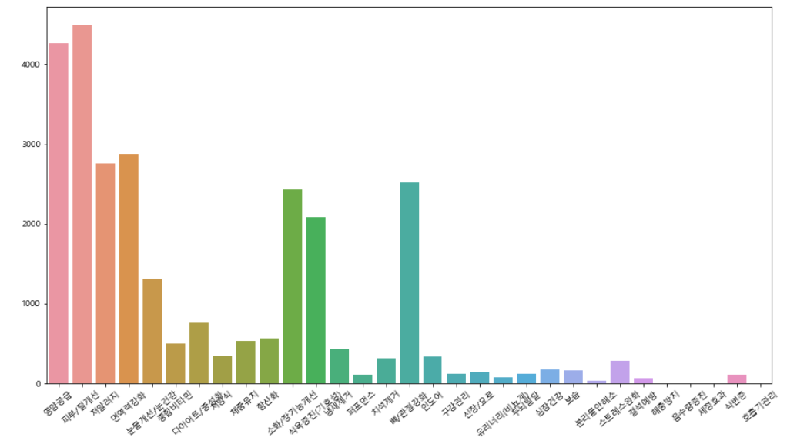
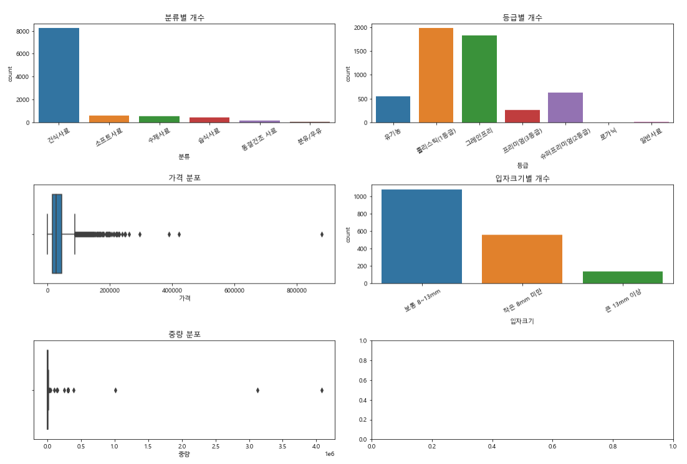
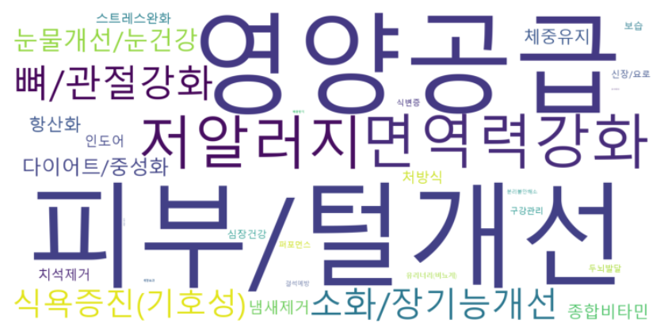

# Mid project(강아지 사료 추천)
**AI SCHOOL 5기 Mid project**   
기간 : 2022-04-19 ~ 2022-04-25   
팀원 : 김나연(팀장), 전준용, 안은지, 정연준, 정다림  
<br><br>

# 주제
- 강아지 사료에 대한 정보를 수집하여 이를 바탕으로 강아지를 키우는 사람이 원하는 정보를 입력할 경우 입력에 대응되는 적절한 사료를 추천
- 주제 선정 이유 : 크롤링을 활용한 텍스트 데이터 분석을 진행하기 위해 주제를 찾다가 욕설 검출, 자동차 리뷰 크롤링을 통한 해당 자동차의 감정분석 등의 주제를 떠올리다가 강아지 사료에 대한 리뷰 데이터가 상당히 많아서 이에 대한 크롤링과 텍스트 분석을 진행해보기로 했다.
<br><br>
## 진행 과정
1. 어떤 사이트를 스크래핑
    1. 쿠팡 : 리뷰글
     - 리뷰글들의 유사도 측정 : 리뷰글을 작성할때, 유저가 작성한 리뷰글과 가장 유사한 리뷰글들을 보여주고, 더 다채로운 리뷰글을 작성할 수 있게 도움
     - 리뷰글들의 정보를 통한 추천 방식 : 리뷰글에서 키워드 추출 → 키워드를 제품 정보에 추가해서 제품 추천에 도움 받기
        1. 리뷰글들 활용의 단점 : 
        - 정보를 얻기가 쉽지 않다 (대부분 일상 단어들로 이루어짐 → 제품에 대한 설명, 제품의 원재료명 등등의 정보를 얻기 쉽지 않음)
        - 리뷰글들의 유사도를 측정할 만큼 긴 리뷰글이 많지 않음 (텍스트 데이터가 적음)
        - 리뷰글의 유사도가 유의미한 차이를 보일지 알 수 없다 → 유사도의 차이가 크지 않을 때, 구별하는 방법
    2. **네이버 쇼핑 : 정보 스크래핑 → 정보들을 기반으로 추천 받기**
    - 최대한 모든 정보들 스크래핑 : 급여대상, 중량, 주원료, 등급, 기능, 입자크기, 리뷰수, 평점, 구매건수, 찜하기 수
    - 정보들을 이용해 유사도 측정 : 추천할 시 각 행의 유사도 점수의 합계로 유사도 sorting
2. 어떤 정보들을 스크래핑
3. 이 정보들을 어떻게 활용하고 / 어떤 추천 시스템을 만들지 (어떤 기준으로)
<br><br>

## 웹 스크래핑 진행 방법
- 셀레니움을 이용한 웹 스크래핑 : BeautifulSoup 사용해서 1페이지 스크래핑 진행 시, 상위 5개만 스크래핑 진행 → 셀레니움을 이용해서 스크롤을 가장 아래로 내린 뒤, 스크래핑 진행

- 스크래핑 한 제품의 수가 약 10000개가 되는 페이지까지 스크래핑 (약 30분 걸림)

- selenium 크롤링 중 chrome not reachable 에러 발생시 아래 코드 적용
```
chrome_options = webdriver.ChromeOptions()
chrome_options.add_argument("--no-sandbox")
chrome_options.add_argument("--disable-setuid-sandbox")
driver = webdriver.Chrome(service=service, chrome_options=chrome_options)
```
<br><br>

## 데이터 전처리
1. **각 열에 대한 전처리**
    1. 설명(전체) : 
    - 급여대상, 중량, 주원료, 기능, 입자크기로 나누고, 없는 정보들을 결측치
    2. 중량 : 쓸데없는 단어 제외하고, 숫자만 → 단위는 그램(g)으로 통일
    3. 가격 : 쓸데없는 단어들 제외하고 숫자만
    4. 평점 : ‘평점’ 단어 제거
    
    1. 등록일 : ‘등록일’ 단어 제거
    2. 등급 : “,”, “(공백)” 제거
    3. 리뷰건수, 구매건수 : 특수기호 제거
2. **연속형 데이터 타입 float으로 변경 : 리뷰건수, 구매건수, 중량, 평점, 찜하기**
3. **기타 생각해보고 시도해봤던 전처리들 : 결측치가 있는 행들을 제외함**   
    **생각보다 전처리의 양이 많고, 시간이 오래 걸림**   
    
    이름에서 "샘플", "신청", "만들기", "사료원료", "모음전"  들어간 행은 제거   
    이름에서 "[~~~]" 는 이름에서 전처리 (필요 없는 정보)   
    이름에서 "~kg" → 중량이 결측치일시 중량으로 추가 (정규표현식...?)   
    이름에서 "유기농" → 등급에 추가   
    이름에서 "체중조절", "알러지", "관절", "피부 모질", "다이어트", "눈물",    "관절", "피부", "스킨컨트롤", "유산균", "눈물자국" 등등 → 기능에 추가    (기능에 있는 단어들이 이름에 나올시 기능에 추가(?)) (replace(?))   
    이름의 "눈물자국", "눈물" 등등 → 기능의 "눈물개선/눈건강"으로 바꿔야 할 필요가 있음   
    이름에서 "가수분해" → 기능에 "저알러지"로 추가   
    이름에서 "퍼피", "어덜트" 등등 → 급여 대상에 추가 (급여 대상에 있는 단어들이 이름에 나올시 급여 대상에 추가(?)) (replace(?))   
    이름에서 "오리", "연어" 등등 → 주원료에 추가 (주원료에 있는 단어들이 이름에 나올시 주원료에 추가(?))   
    
    가격 : 가격/중량으로 1kg 당 중량   
    중량 : kg으로 단위를 정리 ( 소수점은 "."으로 통합)   
    
    등급 : 로가닉 (1등급) / 유기농 (2등급) / 홀리스틱 (3등급) / 슈퍼프리미엄 (4등급) / 프리미엄 (5등급) / 일반사료 (6등급)   
    이름에서 "로얄캐닌" → 슈퍼프리미엄   
    이름에서 "오리젠", "ANF", "프로네이쳐", "내츄럴코어" → 홀리스틱   
    이름에서 "나우사료" , 맨 앞에 "나우"가 오는 경우 → 홀리스틱   
    이름에서 "곰표", "대한사료", "프로베스트" → 일반사료   
    이름에서 "더독"이 맨 앞에 오는 경우 → 슈퍼프리미엄   
    이름에서 "프로플랜" → 프리미엄   
4. **수집 데이터 시각화**
- 스크래핑한 데이터의 결측치
<p align="center"></p>  

- 사료의 급여대상 비교
<p align="center"></p>

- 사료의 각 기능 비교
<p align="center"></p>

- 다양한 열에 대한 비교
<p align="center"></p>

- 사료 이름에 대한 출현빈도 상위단어의 워드클라우드
<p align="center"></p>